# Webex AI Agent Integration with CJDS :robot:

Webex AI Agents allow you to use the power of GenAI inside our Customer Experience flows. Our Autonomous agents assist customers in real time by leveraging a knowledge base with Retrieval-Augmented Generation (RAG) techniques and executing actions through Webex Connect flows. This lab focuses on creating an AI Agent that can retrieve information from and post events to CJDS while supporting customer interactions.

##Lab 4.1 Create an AI Agent and a Knowledge Base

To begin this lab, navigate to Control Hub and select the AI Agents card from the left pane of the Contact Center menu. Click the **Build your AI Agent** button. The AI Agent Studio will open in a new browser tab, where you will configure your AI Agent and Knowledge Base. 

???+ webex "Create a Knowledge Base for your Webex AI Agent"
    1. From the AI Agent Studio, select the notebook icon on the left navigation menu. This is where you will manage your Knowledge Bases. 
    2. Click **Create Knowledge Base**, enter the name as **PODXX_AI_KB** (replace the XX with your POD number), then click **Create**.
    3. Download this generic KB:  <a href="https://github.com/WebexCC-SA/LAB-2851/blob/main/docs/assets/WebexSneakers.txt" target="_blank">Webex_Sneakers_KB</a>. 
    3. Go to the **Files** tab and select the option **Add File**.
    4. Upload the Webex Sneakers KB and select the option **Process Files**.

    ???+ info "Knowledge Base with Files Processed IMG"
        <figure markdown>
        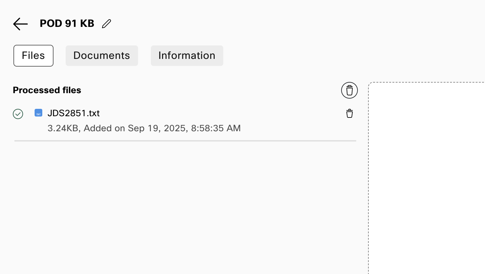
        </figure>

???+ webex "Create your AI Agent"
    1. Navigate to **Dashboard** from the right-hand side menu panel and click **Create Agent**
    2. Select **Start from Scratch** and click **Next**
    3. On the **Create an AI agent** page, select the type of agent: **Autonomous**
    4. A new section called **Add the essential details** will appear. Enter the following information:
      > Agent Name: **PODXX_JDS_AI** (Replace the XX with the POD ID)
      >
      > System ID is created automatically
      >
      > AI engine: **Webex AI Pro-US 1.0**
    5. In the **Agent's goal** section, enter the following:
      > Answer general questions about our online store, Webex Sneakers! Provide information about the customer orders and route to human agents when required.
    6. Click **Create** on the bottom right corner. 
    6. Once the agent is created, update the Welcome Message to say" 
      >Hey! Welcome to Webex Sneakers! How can I help you? 
    7. Switch to **Knowledge** tab and from **Knowledge base** drop-down list select the knowledge base you created. 
    8. Click **Save Changes**. 

    You need to add **Instructions** to orchestrate how the AI Agent will execute an action, but first the Webex Connect flows have to be built. Let's do that! 
    

##Lab 4.2 Build Connect AI Agent Fulfillment Flows. 
Webex Connect has a powerful and intuitive flow builder tool, with its low-code/no-code approach it makes it easy for administrators to build fulfillment flows for our AI Agents. 
In order to start this lab, go back to Control Hub and select the Overview card on the left pane. In the Quick Links section you will see the Webex Connect hyperlink, that will open in another tab of your browser. 

???+ warning
    The variables used in Webex Connect contain the node ID at the beginning, for example in this variable $(n4.Customer_ANI) the **n4** is the node ID. This node ID might be different in your flow, so always double check that the node id matches. This can be done by double clicking the node that is generating the variable and looking at the node id on the bottom left corner. 

???+ webex "Create Fulfillment Flows in Webex Connect"
    1. Find the Service matching your POD ID and click it. 
    2. This will open the dashboard section of your service, click the flows tab to start building. 
    3. Let's start by building a Connect flow that allows the AI Agent to fetch the caller details:
        - Select the option Create Flow and add the name **JDS_Identity**. Click the "Create" button. 
        - This opens the trigger category page, select the **AI Agent** integration trigger. 
        - Now you should see the **Configure AI Agent Event** window open up. In the sample JSON box, remove all of the default values and just leave an empty JSON, like this: 
        ``` JSON
        {}
        ```
        - Click the **Parse** blue button and hit save.
        ???+ info "JDS_Identity Trigger IMG"
            <figure markdown>
            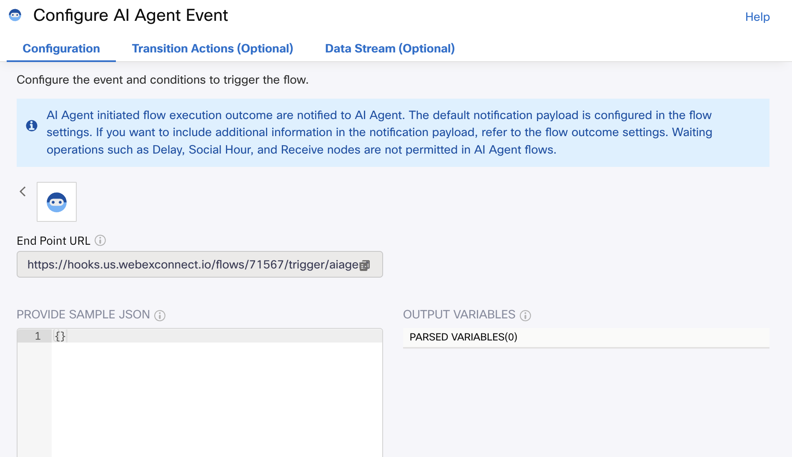
            </figure>
        - From the Node Palette on the left, drag and drop an **Evaluate** node into the canvas. Connect the AI Agent node to the Evaluate node. Double click the **Evaluate** node and enter this code: 
        ```
        var ANItoTime = Date.now() + "";
        var lookbacktime = ANItoTime - 30000;
        var ANIfromTime = lookbacktime + "";
        1;
        ```
        - In the same node, enter the number 1 in the **Script Output** field and in the **Branch Name** enter the word Success. Hit **Save**. 
        ???+ info "JDS_Identity Evaluate IMG"
            <figure markdown>
            
            </figure>
        - Let's add another node, look for a node called WxCC API and bring it to the canvas. Connect the **Evaluate** green output to this new node. Double Click the **WxCC API** node and enter the following information: 
        > From: $(ANIfromTime)
        >
        > To: $(ANItoTime)
        >
        > Corrid: $(corrid)
        - Hit **Save**. 
        ???+ info "JDS_Identity WxCC API IMG"
            <figure markdown>
            
            </figure>
        - Now we are ready to use the CJDS node from Webex Connect, in the node palette find the node called **Journey** and bring it into the canvas. 
        - Connect the success output of the **WxCC API** node into the **Journey** node. Double click it and fill out the fill out the following: 
        > Method Name: Get Identity by Aliases
        >
        > Node Authentication: JDS_CPaaS
        >
        > Project Name: Customer-Journey-Widget
        >
        > Aliases: $(n4.Customer_ANI)
        - Click the **Save** button. 
        ???+ info "JDS_Identity Journey IMG"
            <figure markdown>
            
            </figure>
        - Go into the flow **Settings** by clicking the gear icon on the top right corner. From here, select the **Flow Outcomes** tab and expand the **Last Execution Status** menu. 
        - In this menu you can configure what is going to be sent back to the AI Agent when the action is executed. For this scenario, we want to send back the customer phone number, first name and last name. In the key value section, add the following variables: 
        >| Key    | Value     |
        >| :--------:   | :-------: |
        >| firstName  |  $(n5.firstName)   | 
        >| lastName  | $(n5.lastName) |
        >| phoneNumber | $(n4.Customer_ANI)  |  
        ???+ info "JDS_Identity Outcome IMG"
            <figure markdown>
            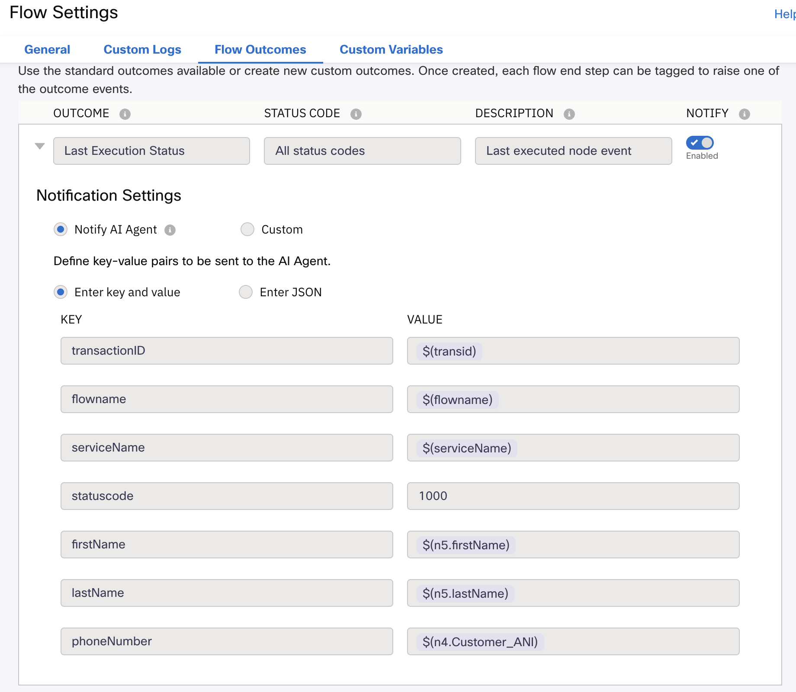
            </figure>
        - Click the **Save** button. Also, click the **Save** button for the flow on the top right corner and then click on **Make Live**. A window will pop up, click the **Make Live** option. 
        - Exit the flow from the top left corner. 
        - As an explanation of the flow, the AI Agent will trigger this flow to collect the user details from CJDS. In order to do this, you configured the **Evaluate** node to get the current time in epoch format and then you are using those values to run a Search API with the **WxCC API** node. This Search API returns the Customer ANI number, then this is used in the **Journey** node to collect the person profile details. 
        ???+ info "JDS_Identity Final Flow IMG"
            <figure markdown>
            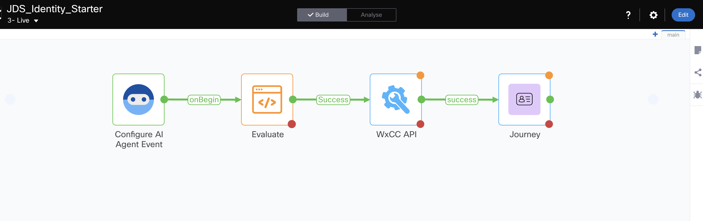
            </figure>
    4. Now let's build a Fulfillment flow to check the status of an order from an external DB: 
        - Select the option Create Flow and add the name **CheckOrder**. Click the "Create" button. 
        - This opens the trigger category page, select the **AI Agent** integration trigger. 
        - Now you should see the **Configure AI Agent Event** window open up. In the sample JSON box, enter the following information: 
        ``` JSON
        {
        "phone": "",
        "accountNumber": ""
        }
        ```
        - Click the **Parse** blue button and hit save.
        ???+ info "Check Order Trigger IMG"
            <figure markdown>
            
            </figure>
        - From the Node Palette on the left, drag and drop an **HTTP Request** node into the canvas. Connect the AI Agent node to the **HTTP Request** node. Double click the **HTTP Request** and setup the following fields: 
          * Method: GET
          * Endpoint URL: https://66d8867237b1cadd8054f426.mockapi.io/CustomerDatabase?AccountNumber=$(n2.aiAgent.accountNumber)
          * Connection Timeout: 10000
          * Request Timeout: 10000
          * Output Variables: 
        >| Output Variable Name     | Response Entity     | Response Path  |
        >| :--------:               | :-------:           |    :----:      |
        >| FirstName                | Body                |    $[0].First  | 
        >| LastName                | Body                |    $[0].Last  | 
        >| Product                | Body                |    $[0].Product  | 
        >| InitialArrival                | Body                |    $[0].initialArrival  |
        >| CurrentArrival                | Body                |    $[0].currentArrival  | 
        >| PaymentType                | Body                |    $[0].paymentType  | 
        >| OrderStatus                | Body                |    $[0].orderStatus  |
        - Click the **Save** button.
        ???+ info "Check Order HTTP Request IMG"
            <figure markdown>
            
            </figure>
        - Drag and drop the Journey node into the canvas. Connect the success output of the **HTTP Request** node into the **Journey** node. Double click it and fill out the fill out the following: 
        > Method Name: Write to CJDS
        >
        > Node Authentication: JDS_CPaaS
        >
        > Project Name: Customer-Journey-Widget
        >
        > Request Body Object: Complete Object
        >
        > Request Body Object JSON: 
        ``` JSON
        {
           "id":"$(n2.aiAgent.transId)",
           "specversion":"1.0",
           "type":"Order Status",
           "source":"IVR",
           "identity":"$(n2.aiAgent.phone)",
           "identitytype":"phone",
           "datacontenttype":"application/json",
           "data":{
              "taskId":"$(corrid)",
              "firstName":"$(n3.FirstName)",
              "lastName":"$(n3.LastName)",
              "phone":"$(n2.aiAgent.phone)",
              "product":"$(n3.Product)",
              "paymentType":"$(n3.PaymentType)",
              "channelType":"IVR",
              "initialArrival":"$(n3.InitialArrival)",
              "currentArrival":"$(n3.CurrentArrival)",
              "uiData":{
                 "title":"Check Order Status",
                 "iconType":"",
                 "subTitle":"$(n3.OrderStatus)",
                 "filterTags":[
                    "Order Status"
                 ]
              }
           }
        }
        ```
        - Click the **Save** button. 
        ???+ info "Check Order Journey IMG"
            <figure markdown>
            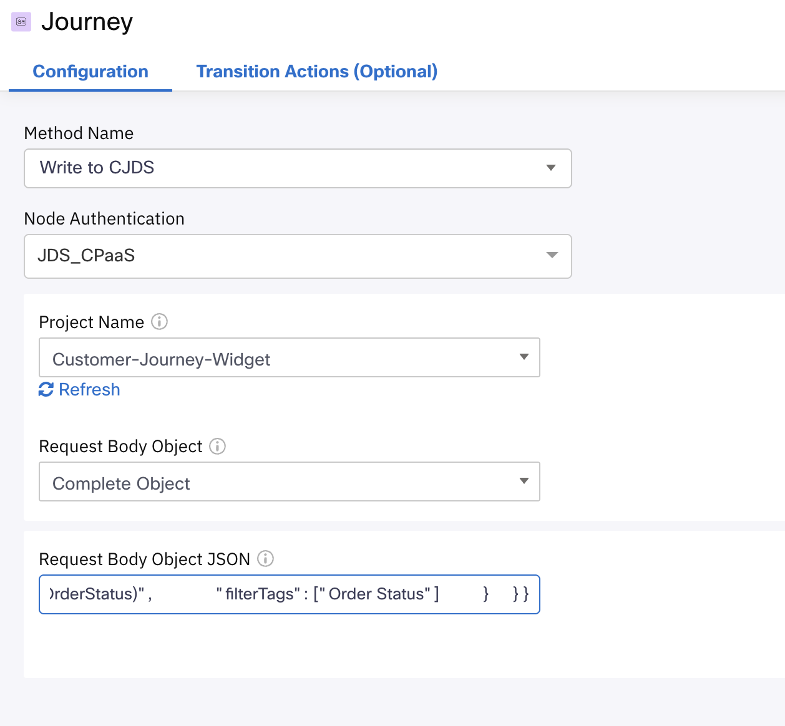
            </figure>
        - Go into the flow **Settings** by clicking the gear icon on the top right corner. From here, select the **Flow Outcomes** tab and expand the **Last Execution Status** menu. 
        - In the key value section, add the following variables: 
        >| Key    | Value     |
        >| :--------:   | :-------: |
        >| product  |  $(n3.Product)   | 
        >| paymentType  | $(n3.PaymentType) |
        >| InitialArrival | $(n3.InitialArrival)  |  
        >| CurrentArrival | $(n3.CurrentArrival) |
        >| OrderStatus | $(n3.OrderStatus) |
        ???+ info "Check Order Outcome IMG"
            <figure markdown>
            
            </figure>
        - Click the **Save** button. Also, click the **Save** button for the flow on the top right corner and then click on **Make Live**. A window will pop up, click the **Make Live** option. 
        - Exit the flow from the top left corner. 
        ???+ info "Check Order Final Flow IMG"
            <figure markdown>
            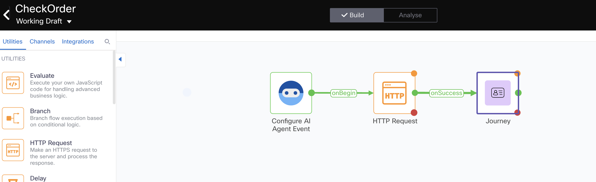
            </figure>
    5. We are down to our last fulfillment flow, this will be a **SMS Deflection** flow. The AI Agent will offer customers to use our SMS digital channel: 
        - Select the option Create Flow and add the name **SMS_Deflection**. Click the "Create" button. 
        - This opens the trigger category page, select the **AI Agent** integration trigger. 
        - Now you should see the **Configure AI Agent Event** window open up. In the sample JSON box, enter the following information: 
        ``` JSON
        {
          "phone": "",
          "firstName": "",
          "lastName": ""
        }
        ```
        - Click the **Parse** blue button and hit save.
        ???+ info "SMS Deflection Trigger IMG"
            <figure markdown>
            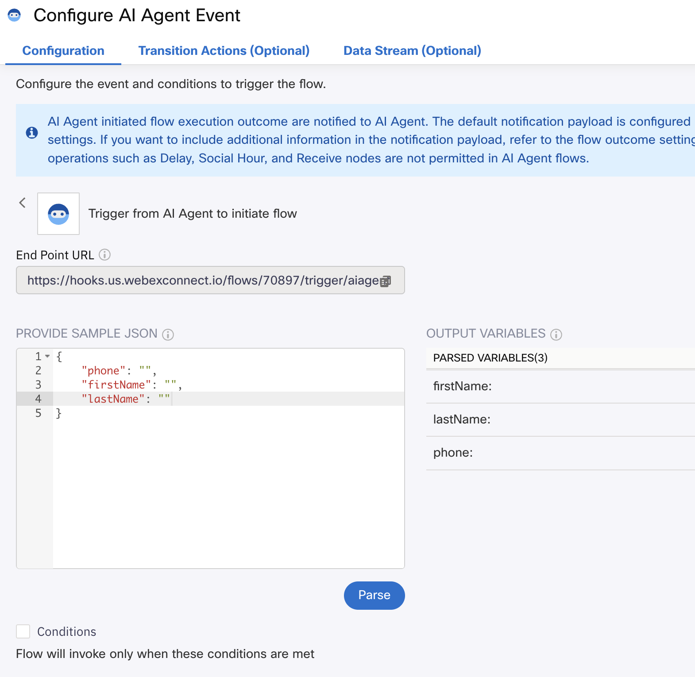
            </figure>
        - From the Node Palette on the left, drag and drop a **SMS** node into the canvas. Connect the AI Agent node to the **SMS** node. Double click the **SMS** and setup the following fields:
          > Destination Type: msisdn
          >
          > Destination: $(n2.aiAgent.phone)
          >
          > From Number: **Select the SMS number assigned to your POD**
          >
          > Message Type: Text
          >
          > Message: Thank you for accepting to try our customer support service over digital channels! If this is a good moment to connect you to an agent, please reply with the phrase "GoToQueue".
        - Click the **Save** button.
        ???+ info "SMS Deflection SMS IMG"
            <figure markdown>
            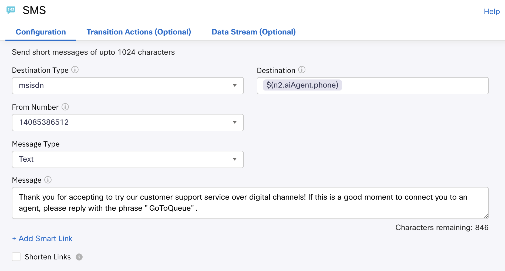
            </figure>
        - Drag and drop the Journey node into the canvas. Connect the success output of the **SMS** node into the **Journey** node. Double click it and fill out the fill out the following: 
        > Method Name: Write to CJDS
        >
        > Node Authentication: JDS_CPaaS
        >
        > Project Name: Customer-Journey-Widget
        >
        > Request Body Object: Complete Object
        >
        > Request Body Object JSON: 
        ``` JSON
        {
          "id":"$(n2.aiAgent.transId)",
          "specversion":"1.0",
          "type":"SMSDeflection",
          "source":"IVR",
          "identity":"$(n2.aiAgent.phone)",
          "identitytype":"phone",
          "datacontenttype":"application/json",
          "data":{
             "taskId":"$(corrid)",
             "firstName":"$(n2.aiAgent.firstName)",
             "lastName":"$(n2.aiAgent.lastName)",
             "phone":"$(n2.aiAgent.phone)",
             "channelType":"IVR",
             "uiData":{
                "title":"Digital Channel Deflection",
                "iconType":"icon-sms_16",
                "subTitle":"SMS",
                "filterTags":[
                   "Digital Channel Deflection"
                ]
             }
          }
        }
        ```
        - Click the **Save** button. 
        ???+ info "SMS Deflection Journey IMG"
            <figure markdown>
            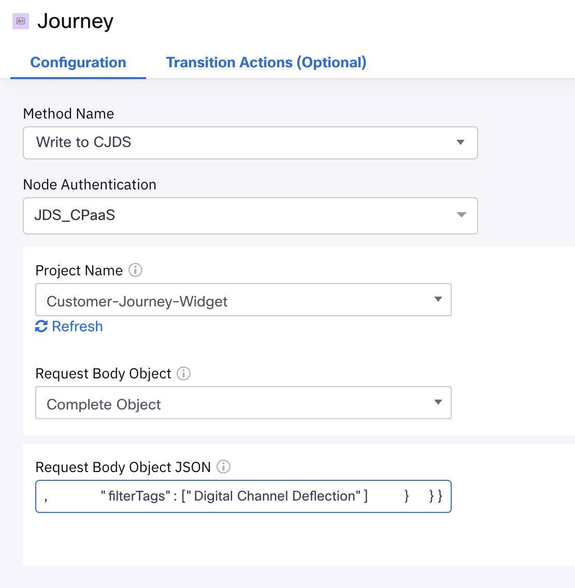
            </figure>
        - Click the **Save** button. Also, click the **Save** button for the flow on the top right corner and then click on **Make Live**. A window will pop up, click the **Make Live** option. 
        - Exit the flow from the top left corner. 
        ???+ info "SMS Deflection Final Flow IMG"
            <figure markdown>
            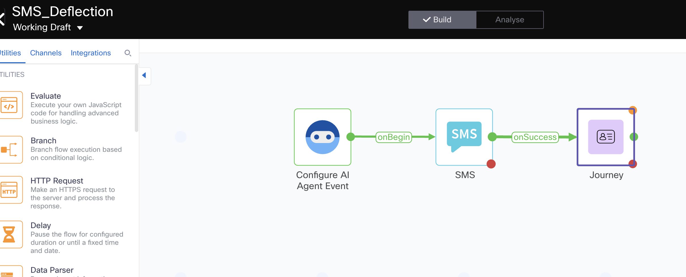
            </figure>


##Lab 4.3 AI Agent Instructions and Actions
In this section, you will setup AI Agent actions that use the fulfillment flows created in the previous section. Also, you will add the instructions on when to use those actions. 

???+ webex "Create Actions"
    1. Switch to the **Actions** tab and click the **New action** button. Proceed to name the action **JDS_Identity**, add a description and select the **Action Scope** option called **Slot filling and fulfillment**. 
    2. In the **Webex Connect Flow Builder Fulfillment** section, select the **POD XX** service and the flow **JDS_Identity**. Click the "Add" button. 

        ???+ info "JDS Identity Action IMG"
            <figure markdown>
            
            </figure>
    3. Click the **New action** button again, and proceed to name the action **Check_Order**, add a description and select the action scope option called **Slot filling and fulfillment**. 
    4. Create new input entities for the data required to check the order status, these are the details for each entity:
    <br>
      >| Entity Name      | Type     | Value  | Description  |
      >| :--------:       | :-------:| :----: | :---------:  |
      >| accountNumber    | number   |    -   | account number, 8 digits |
      >| phone     | phone    | **Use default regex**| A valid phone number with country code. This phone number will be returned from the JDS_Identity action. |
    5. In the **Webex Connect Flow Builder Fulfillment** section, select the **POD XX** service and the flow **CheckOrder**. Click the "Add" button.  

        ???+ info "Check Order Action IMG"
            <figure markdown>
            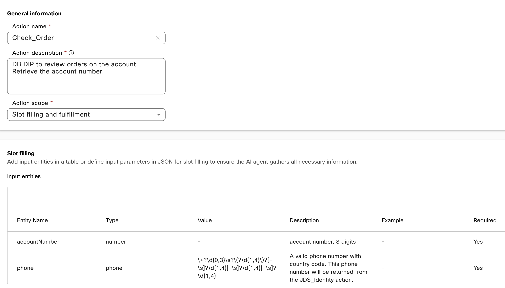
            </figure>
    6. Click the **New action** button again, and proceed to name the action **SMS_Deflection**, add a description and select the action scope option called **Slot filling and fulfillment**. 
    7. Create new input entities for the data required to send a SMS to the user, these are the details for each entity:
    <br>
      >| Entity Name      | Type     | Value  | Description  |
      >| :--------:       | :-------:| :----: | :---------:  |
      >| firstName | string   |    -   | This variable was returned from the JDS_Identity action. Do not ask the user. |
      >| lastName  | string   |    -   | This variable was returned from the JDS_Identity action. Do not ask the user. |
      >| phone     | phone    | **Use default regex**| A valid phone number with country code. This phone number will be returned from the JDS_Identity action. |
    7. In the **Webex Connect Flow Builder Fulfillment** section, select the **POD XX** service and the flow **SMS_Deflection**. Click the "Add" button.  

        ???+ info "SMS Deflection Action IMG"
            <figure markdown>
            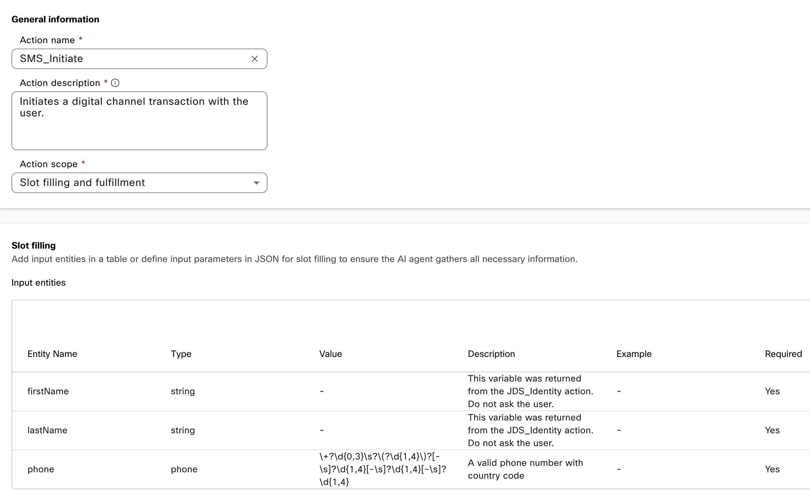
            </figure>
        ???+ info "List of Actions IMG"
            <figure markdown>
            
            </figure>
    8. Go back to the Profile tab on the AI Agent configuration page. In the instructions section, enter the following: 
    ```
    # Instructions
      **Execute step 1 before answering any questions or triggering any other actions**
      1. Inform the user that you will fetch their details, do this by executing the action JDS_Identity. 
      2. After getting the user details from the JDS_Identity action, greet the user by their first and last name. 
      3. Answer the user questions. 
      4. If the user wants to check their order status, collect their account number and use the action Check_Order to get the details. 
      5. If there are any issues with the order (delays, lost in transit, etc), ask the user if they want to proceed with a refund or replacement. Use the {{initialArrival}} and {{currentArrival}} dates to verify how much time the order has been delayed or lost. **Follow policies from the KB to determine if you can process the refund** 
      6. **Voice Channel Only** If the user wants to talk to a human agent or the company policies require you to do the transfer, first offer the user if they would like to continue this transaction over SMS. Inform them that our digital queue is faster and this way they won't have to wait long times on queue.  
      7. If they accept, trigger the action SMS_Initiate and inform the user they will receive a SMS shortly.
    ```
    9. Click the option **Save Changes** and then **Publish**, provide any version name. Your AI Agent is now ready for testing.

        ???+ info "Final AI Agent IMG"
            <figure markdown>
            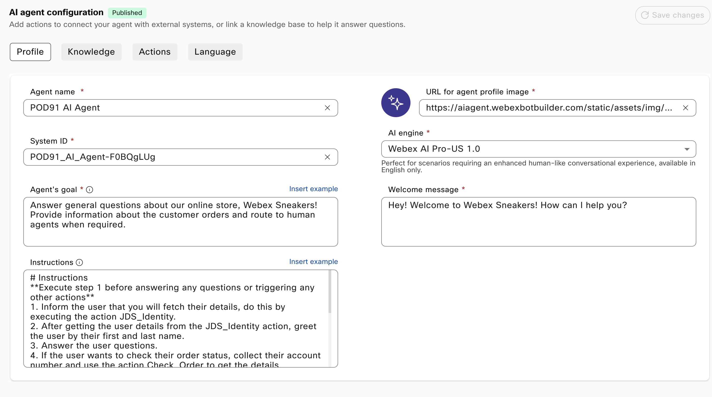
            </figure> 

## Testing :test_tube:
In Lab 3 you configured a voice flow and selected a placeholder AI Agent in the VA V2 node, go back to your voice flow and update that node to use your new AI Agent. Once you make the changes, remember to validate and publish your IVR flow. Once this is done, here's what you can do to test: 

???+ webex "Testing AI Agent Integration with CJDS"
    1. Place a call to your voice flow and select option 1 in the menu. 
    2. Ask a couple of questions that are included in the Knowledge Base file you uploaded, for example: 
        - Are there any ongoing promotions? 
        - How long does shipping normally take? 
        - Are your sneakers authentic? 
    3. After you get some answers, ask about your order status. 
    4. It should tell you the order is delayed, but that it can't help with a refund or replacement for you because of store policies. 
    5. Insist that you want a refund and the AI Agent should offer you to use the SMS channel to talk to a human agent. Say yes and you should receive a SMS (Only US numbers). 
    6. Go to your Agent Desktop and on the JDS widget do a search for your phone number, you should see the events pushed from the AI Agent for Order Status and SMS Deflection. 

You have completed the JDS 2851 Lab, Congratulations! 