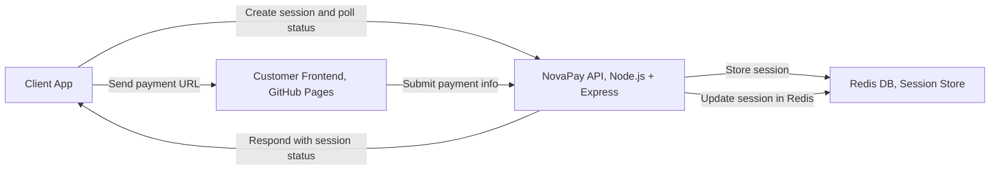

# Lab Purpose

The purpose of this lab is to build a fake payment service for demo purposes. The outcome of this lab is twofod: 

1. A mockpayment frontend web site that mimics a typical payment user interface. It shoud offer an interface for the user to enter the payment amount, the card option (visa, master card...) and the card details (name, number, expiration date and cvv). It should allow a user to enter the data and click on a pay button to confirm the payment. The web site should respond with a confirmation message that the payment has been completed. The user will see the amount payed, the last 4 digits of its credit card and a mock confirmation number.

???+ warning 
	This is a UI simulation only. It does not process real payments, store data, or connect to any backend.
	Note: The application does not run any format validation on the input data

2. A web service that exposes an API to allow a third party to open a payment session for the customer to pay and complete the payment. It shall also provide the session status to check whether the payment has been completed. 

This lab provides a **step-by-step guide** to replicate and deploy your own version of the **NovaPay Payment Service** using the existing implementation available in the `MockPayment` GitHub repository.

---


# Pre-Requisites
This section outlines the required technologies, platforms, and applications needed to build, deploy, and operate the NovaPay Mock Payment Service.

The implementation of the service relies on a lightweight web-based architecture composed of a hosted frontend, a backend API layer, a persistent session store, and an external Desktop Agent application capable of invoking REST APIs.

## Required components
The following table summarizes the core components required to implement the NovaPay payment service:

|Service | Component| Role in NovaPay|
|--------|---------|----------------|
|GitHub|Frontend|Hosting the static payment page and version control for the entire codebase.|
|Render|Backend|Cloud hosting for the Node.js/Express API (Session management & processing).|
|Redis Cloud|Database|Providing a managed Key-Value store for persistent, fast session storage.|

## Required Applications and Accounts

In order to successfully deploy the NovaPay service, the following applications and user accounts must be available:

1. Development Environment

	- Node.js (v18 or later recommended) - Required to run the backend API locally. Includes npm for dependency management

	- Git - Required for source code version control, Used to push backend and frontend code to GitHub

	- Code Editor - Recommended: Visual Studio Code (VSCode). Used to develop and modify backend and frontend files

2. Hosting & Deployment Platforms

	- GitHub Account: Host the frontend payment page via GitHub Pages. Store backend implementation code

	- Render Account: Deploy the NovaPay Backend API as a Web Service and deploy the Redis Key-Value Store instance. It also manages environment variables

3. Testing Tools

	- Postman (or similar API client) - Test NovaPay REST APIs. Simulates client app behavior and validates session creation and payment confirmation.


#  General overview of the NovaPay payment service. 

**NovaPay** is a mock payment service designed for developer testing and integration purposes. It provides a simple, secure payment flow where an agent can generate a payment session, share a frontend URL with a customer, and confirm the payment. The service stores session data in Redis and allows polling from a desktop or web application to verify payment completion.

## Architecture Overview



---

# 📌 Lab Overview

In this lab you will perform the following tasks:

1. Replicate the NovaPay GitHub Repository  
2. Modify project configuration to reflect your new service  
3. Configure GitHub Pages to host the payment frontend  
4. Deploy the Backend API on Render  
5. Deploy the Redis Key-Value Store on Render  
6. Configure environment variables  
7. Test NovaPay APIs using Postman  

---

# 🔹 STEP 1 — Replicate the Repository

You will create your own copy of the NovaPay implementation currently hosted in the **MockPayment** repository.

---

???+ "Import Repository"

	1. Log in to your **GitHub Account**
	2. Navigate to: https://github.com/new/import
	3. Populate the fields as follows:

	| Field | Value |
	|------|------|
	| Repository URL | https://github.com/cx-partner/NovaPay |
	| Owner | Your GitHub Username |
	| Repository Name | NovaPay |

	

	???+ "Import the Repository to GitHub GIF"

		<figure markdown>
            
            </figure>

    4. Click: ***Begin Import***

    GitHub will start importing the repository. After completion, you will now have:
    	´´´
    	https://github.com/<your-username>/NovaPay
    	´´´

---

# 🔹 STEP 2 — Configure GitHub pages (Frontend Hosting)

NovaPay frontend will be hosted publicly using GitHub Pages.

---

???+ Enable GitHub Pages

	You need first to enable GitHub Pages in your new repository. 

	1. Navigate to your repository in GitHub

	```
	NovaPay → Settings → Pages
	``
	2. under **Source**, select: *Deploy from Branch*
	3. under **Branch**, select: 
		Branch: *main*
		Folder: */(root)
	4. Click on **Save**

	???+ Enable GitHub Pages GIF
		<figure markdown>
            
            </figure>


