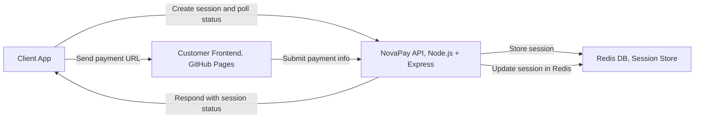
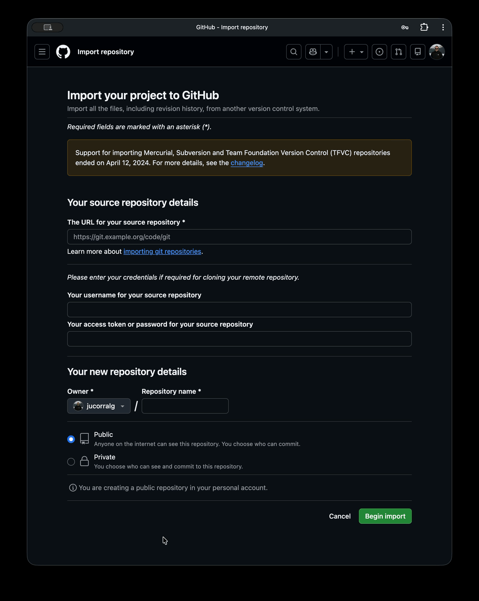
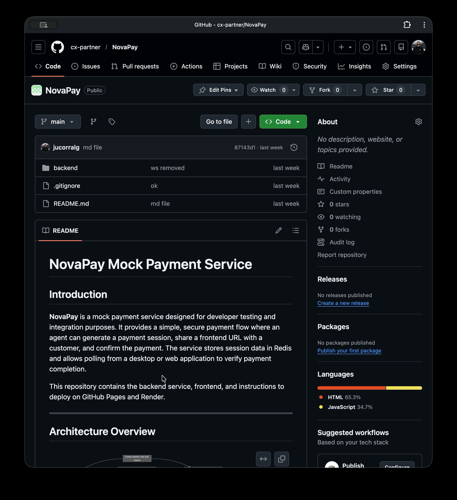
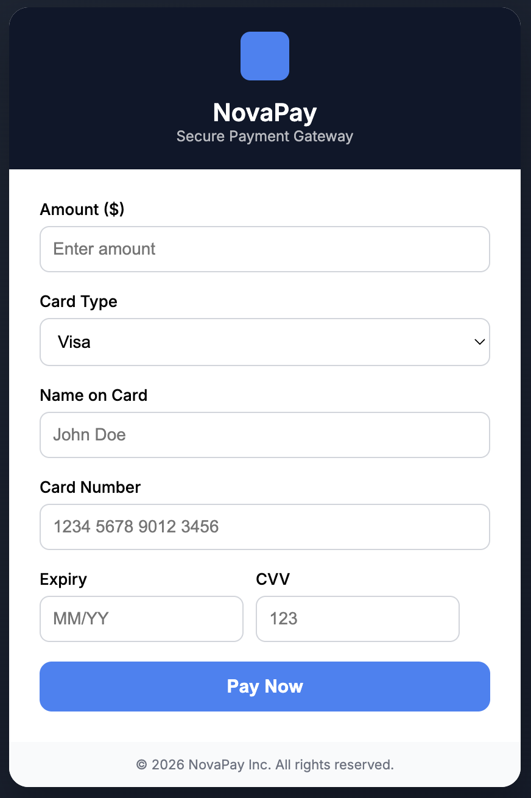

# Lab Purpose

The purpose of this lab is to build a fake payment service for demo purposes. The outcome of this lab is twofod: 

1. A mockpayment frontend web site that mimics a typical payment user interface. The frontend offers a user interface to enter the payment data: amount, card option (visa, master card...) and  card details (name, number, expiration date and cvv). It allows a user to enter the data and click on a pay button to confirm the payment. The web site responds with a confirmation message that the payment has been completed. The user will see the amount payed, the last 4 digits of its credit card and a mock confirmation number.

	???+ warning  
		This is a UI simulation only. It does not process real payments, store data, or connect to any backend.

		Note: The application does not run any format validation on the input data

2. A web service that exposes an API to allow a third party to open a payment session for the customer to pay and complete the payment. It also provides the session status to check whether the payment has been completed. 

This lab provides a **step-by-step guide** to replicate and deploy your own version of the **NovaPay Payment Service** using the existing implementation available in the [Novapay](https://github.com/cx-partner/NovaPay) GitHub repository.

---


# Pre-Requisites
This section outlines the required technologies, platforms, and applications needed to build, deploy, and operate the NovaPay Mock Payment Service.

The implementation of the service relies on a lightweight web-based architecture composed of a hosted frontend, a backend API layer, a persistent session store, and an external Desktop Agent application capable of invoking REST APIs.

## Required components
The following table summarizes the core components required to implement the NovaPay payment service:

|Service | Component| Role in NovaPay|
|--------|---------|----------------|
|GitHub|Frontend|Hosting the static payment page and version control for the entire codebase.|
|Render|Backend|Cloud hosting for the Node.js/Express API (Session management & processing).|
|Redis Cloud|Database|Providing a managed Key-Value store for persistent, fast session storage.|

## Required Applications and Accounts

In order to successfully deploy the NovaPay service, the following applications and user accounts must be available:

1. Development Environment

	- Node.js (v18 or later recommended) - Required to run the backend API locally. Includes npm for dependency management

	- Git - Required for source code version control, Used to push backend and frontend code to GitHub

	- Code Editor - Recommended: Visual Studio Code (VSCode). Used to develop and modify backend and frontend files

2. Hosting & Deployment Platforms

	- GitHub Account: Host the frontend payment page via GitHub Pages. Store backend implementation code

	- Render Account: Deploy the NovaPay Backend API as a Web Service and deploy the Redis Key-Value Store instance. It also manages environment variables

3. Testing Tools

	- Postman (or Bruno or similar API client) - Test NovaPay REST APIs. Simulates client app behavior and validates session creation and payment confirmation.


#  General overview of the NovaPay payment service. 

**NovaPay** is a mock payment service designed for developer testing and integration purposes. It provides a simple, secure payment flow where an agent can generate a payment session, share a frontend URL with a customer, and confirm the payment. The service stores session data in Redis and allows polling from a desktop or web application to verify payment completion.

## Architecture Overview



---

# 📌 Lab Overview

In this lab you will perform the following tasks:

1. Replicate the NovaPay GitHub Repository  
2. Configure GitHub Pages to host the payment frontend  
4. Deploy the Backend API on Render  
5. Deploy the Redis Key-Value Store on Render  
6. Configure environment variables  
7. Test NovaPay APIs using Postman  

---

# 🔹 STEP 1 — Replicate the NovaPay Repository

You will create your own copy of the NovaPay implementation in your own repository. Currently, all the assets for the service are located in a GitHub hosted repository: [Novapay](https://github.com/cx-partner/NovaPay), owned by Cisco.

---

???+ "Import NovaPay GitHub Repository"

	1. Log in to your **GitHub Account**
	2. Navigate to: <a href="https://github.com/new/import" target="_blank">Import Repository</a> 
	3. Populate the fields as follows:

	| Field | Value |
	|------|------|
	| Repository URL | https://github.com/cx-partner/NovaPay |
	| Owner | <Your GitHub Username> |
	| Repository Name | NovaPay |

	

	???+ "Import the Repository to GitHub GIF"

		<figure markdown>
            
            </figure>

    4. Click: ***Begin Import***

    GitHub will start importing the repository. After completion, you will now have your own NovaPay repository in GitHub:
    	
    	```https://github.com/<your-username>/NovaPay```
    

---

# 🔹 STEP 2 — Configure GitHub pages (Frontend Hosting)

NovaPay frontend will be hosted publicly using GitHub Pages.

---

???+ "Enable GitHub Pages"

	You need first to enable GitHub Pages in your new repository. 

	1. Navigate to your repository in GitHub

	```
	NovaPay → Settings → Pages
	```
	2. under **Source**, select: *Deploy from Branch*
	3. under **Branch**, select: 
		- Branch: *main*
		- Folder: */(root)*
	4. Click on **Save**

	???+ "Enable GitHub Pages GIF"
		<figure markdown>
            
            </figure>


???+ "Obtain your Frontend URL"
	Once GitHub pages is deployed, GitHub generates a public URL for you: 

	```
	https://<your-username>.github.io/NovaPay/backend/frontend/index.html
	```	

	If you try this URL, you will get to the NovaPay payment service web site. Try it!

	Take note of this URL. You will need it later. 

	???+ "The NovaPay payment Website"

		<figure markdown>
            
            </figure>

--- 

# 🔹 STEP 3 — Deploy Backend API on Render

???+ "Create Render Account"

	If you do not have a Render account, navigate to:

	<a href="https://render.com" target="_blank">Render</a> 

	Create an account:
		1. Click on *Start for free*
		2. Create your render account

	???+ tip "Leverage your GitHub user"

		Select the GitHub option and enter yout GitHub credentials. That will connect your render workspace with your GitHub environment.

	???+ "Create a Render user GIF"
		<figure markdown>
            
            </figure>

???+ "Create your Web Service"
	1. Select:
		```
	 	New -> Web Service
	 	```

	2. Under Git Provider, select your NovaPay Repository
		- Select GitHub
		- 


	3. Populate the configuration
		
		| Field          | Value          |
		| -------------- | -------------- |
		| Name           | NovaPay        |
		| Region		 | Select the region that best suits you |
		| Root Directory | backend        |
		| Environment    | Node           |
		| Build Command  | npm install    |
		| Start Command  | node server.js |

	4. Select the Instance Type (free will work) and Click on **Create Web Service**

	Render will start building your service and then it will be deployed. After a while, you will see your service **Live**

	???+ warning
		With the free instance option, your free instance will spin down with inactivity, which can delay requests by 50 seconds or more.

	???+ "Create a Render Web Service GIF"
		<figure markdown>
            
            </figure>

---

## 🔹 STEP 4 — Deploy Redis Key-Value Store

???+ "Create Redis Instance"

	As we are implementing a polling architecture, we need something that can persist payment session state outside of the API process and make it quickly retrievable across multiple stateless requests. Our backend service running in Render is stateless, containerized and restartable at any moment, so we cannot store session state in memory inside Node.js. That’s exactly why Redis is required.

	1. In Render, add a new Key Value
		```
		+ New -> Key Value
		```
	2. Populate: 

		| Field | Value         |
		| ----- | ------------- |
		| Name  | novapay_redis |
		| Region| same as for the Web Service |
		| Plan  | Free          |

	3. Click **Create Key Value Instance**

	???+ "Create Redis Instance GIF"

		<figure markdown>
            
            </figure>

???+ "Obtain Redis Internal URL"

	1. After creation, navigate to 

		```novapay-redis → Info ```	

	2. Scroll down to the **Internal Key Value URL**

		```Example: redis://red-d6g98xxxxxxc73daj4vg:6379 ```

	3. Copy it, you will need it later. 

	???+ "Redis internal URL IMG"
		<figure markdown>
            
            </figure>
---
## 🔹 STEP 5 — Configure Environment Variables

We need to define a couple of environmental variables. Navigate to your workspace. You should see your two active services now.

???+ "NovaPay services in Render IMG"
	<figure markdown>
            
            </figure>

???+ "Novapay Environment Variables"
    1. Click on the Novapay service
    2. In the Left Navigation menu, click on **Environment**
    3. Under Environment Variables, add the following variables:

    	| Key          | Value                                                      |
		| ------------ | ---------------------------------------------------------- |
		| REDIS_URL    | The Internal Redis URL you copied above                    |
		| FRONTEND_URL | https://<your-GitHub-username>.github.io/NovaPay/backend/frontend |

	4. Click on **Save, Rebuild and Deploy**


	???+ "Novapay Environment Variables GIF"

		<figure markdown>
            
            </figure>

---

## 🔹 STEP 6 — Verify Deployment

Once deployed, your NovaPay API will be accessible via:

```https://<your-render-url>.onrender.com```

where your-render-url is of the type *novapay-xxxx*

Verify the backend health: 

```GET https://<your-render-url>.onrender.com/health ```

Expected response:   Backend is running

---

## 🔹 STEP 7 — Frontend Configuration Changes (index.html)

Your frontend is hosted using GitHub Pages, but it still references the old backend endpoint from the original service. You must update the NovaPay API URL in the payment page to your own API.

???+ "Frontend adaptation"

	1. in GitHub, navigate to 
		```backend/frontend/index.html```
	2. Locate the Backend API reference in the file. Find the section in the javascript code where the backend Novapay API is called. 

		```javascript
		const response = await fetch("https://novapay-2590.onrender.com/api/pay"
		```
	3. Replace the API URL with the URL of your own NovaPay API. (you simply need to replay the four characters following *novapay-*)

???+ warning

	Do not forget to commit and push any change in GitHub. Render will automatically trigger a new deployment for the service. 
---

## 🔹 STEP 8 — Test APIs Using Postman

???+ warning
    Test can be done with Bruno or Postman clients. In any case, make sure the desktop versions are installed in the laptop, do not use any web versions. 


???+ "Create a Payment session"
	- Request: 
		```POST /api/create-session```
	- URL: 
		```https://novapay-xxxx.onrender.com/api/create-session```
	- Body:
		``` JSON
		{
  			"amount": 120,
  			"customerEmail": "test@test.com",
  			"agentId": "agent01"
		}```
	- Response:
		``` JSON
		{
  			"sessionId": "xxxx",
  			"paymentUrl": "https://<your-username>.github.io/NovaPay/backend/frontend/index.html?sessionId=xxxxxx&amount=xxx"
		}```	

???+ "Verify Payment status"
	- Request: 
		```GET /api/session-status```
	- URL: 
		```https://novapay-xxxx.onrender.com/api/session-status?sessionId=xxxx```
	- Response:
		Payment pending: 
		``` JSON
		{
		    "agentId": "agent123",
		    "amount": 2500,
		    "customerEmail": "jucorral@cisco.com",
		    "status": "pending"
		}```

		Payment completed:
		``` JSON
		{
		    "agentId": "agent123",
		    "amount": 2500,
		    "customerEmail": "jucorral@cisco.com",
		    "status": "completed",
		    "last4": "1234",
		    "confirmationCode": "NP-47QXLJCS"
		}```

???+ "Execute Payment"	
	- Request: 
		```POST /api/pay```
	- URL: 
		```https://novapay-xxxx.onrender.com/api/pay```
	- Request:
		``` JSON
		{
		  "sessionId": "123434523452345",
		  "amount": 432421,
		  "cardNumber": "1234123412341234",
		  "cardName": "John Doe",
		  "expiry": "12/27",
		  "cvv": "123"
		}```
	- Response:
		``` JSON
		{
		    "status": "success",
		    "amount": 2500,
		    "last4": "1234",
		    "confirmationCode": "NP-47QXLJCS"
		}```


???+ "Server Healthcheck"
	- Request: 
		```GET /health```
	- URL: 
		```https://novapay-xxxx.onrender.com/health```
	- Response:
		```Backend is running```

--- 

# ✅ Lab Completion

At this point, you have successfully:

- [x] Replicated the NovaPay Service

- [x] Hosted the Payment Frontend via GitHub Pages

- [x] Deployed the Backend API on Render

- [x] Configured Redis for Persistent Sessions

- [x] Tested Payment Session Creation

- [x] Completed a Mock Payment Transaction

- [x] Retrieved Payment Confirmation via API

You now have a fully operational NovaPay Mock Payment Service running on the Internet.

---

# 🛠️ Troubleshooting Guide

This section describes the most common issues encountered during the deployment and testing of the NovaPay Payment Service, along with recommended solutions.

???+ "❌ 1. GitHub Pages Payment Page Shows 404 Error"
	🔍 Symptoms

		When accessing the payment URL:

		```https://<yourusername>.github.io/novapay/?sessionId=12345```

		You receive:

		```404 Page Not Found```

	✅ Possible Causes & Solutions

	| Cause                                  | Solution                                                                     |
	| -------------------------------------- | ---------------------------------------------------------------------------- |
	| GitHub Pages not enabled               | Go to Repository → Settings → Pages and enable deployment from `main` branch |
	| Wrong folder selected                  | Ensure GitHub Pages is configured to deploy from `/root`                     |
	| Repository renamed but URL not updated | Update payment URL in `server.js`                                            |
	| Changes not committed                  | Commit and push latest changes to GitHub                                     |


???+ "❌ 2. Payment Page Loads but Shows "Session Not Found""
		🔍 Symptoms

		The payment page opens correctly but displays:

		```Session Not Found```

	✅ Possible Causes & Solutions

	| Cause                                         | Solution                                      |
	| --------------------------------------------- | --------------------------------------------- |
	| Backend API URL still pointing to MockPayment | Update API endpoint in `/frontend/index.html` |
	| Backend service not running in Render         | Verify deployment status in Render dashboard  |
	| Session expired in Redis                      | Recreate payment session via Postman          |
	| Incorrect `sessionId` in URL                  | Ensure sessionId is passed correctly          |


???+ "❌ 3. Backend Fails to Connect to Redis"
		🔍 Symptoms

		Render logs show:

		```Error: connect ECONNREFUSED 127.0.0.1:6379``
	
	✅ Possible Causes & Solutions

	| Cause                                  | Solution                                       |
	| -------------------------------------- | ---------------------------------------------- |
	| Redis URL still set to localhost       | Replace Redis config in `/backend/server.js`   |
	| Missing environment variable           | Add `REDIS_URL` in Render Environment settings |
	| Redis instance not created             | Create Redis service in Render dashboard       |
	| Using External instead of Internal URL | Use Internal Redis URL from Render             |

???+ "❌ 4. CORS Error When Loading Payment Session"
	🔍 Symptoms

		Browser developer console shows:

		```Access to fetch at 'https://novapay-api.onrender.com' from origin 'https://yourusername.github.io' has been blocked by CORS policy```
	
	✅ Solution

	Ensure CORS is enabled in your backend.

	Install CORS middleware:
	```npm install cors```

	Add the following to your server.js:

	```javascript 
	const cors = require("cors");
	app.use(cors());```

	Commit and push changes to redeploy in Render.

???+ "❌ 5. Render Deployment Fails During Build"
	🔍 Symptoms

		Deployment logs show:

		```npm ERR! missing script: start```

	✅ Solution

	Ensure your /backend/package.json includes:

	``` JSON
	"scripts": {
	  "start": "node server.js"
	}```	

	Commit and push changes to GitHub to trigger a new deployment.

???+ "❌ 6. Postman API Tests Fail"
	🔍 Symptoms

		Requests to create or retrieve payment sessions return:

		```500 Internal Server Error```
	
	✅ Possible Causes & Solutions

	| Cause                  | Solution                                |
	| ---------------------- | --------------------------------------- |
	| Backend not deployed   | Verify Render deployment                |
	| Redis not connected    | Check REDIS_URL environment variable    |
	| Incorrect API endpoint | Confirm Postman uses Render backend URL |
	| Missing headers        | Add `Content-Type: application/json`    |

???+ "❌ 7. Payment Status Never Updates (Desktop Polling)"
	🔍 Symptoms

		Desktop agent keeps polling but always receives:

		```status: pending```

	✅ Possible Causes & Solutions

	| Cause                         | Solution                            |
	| ----------------------------- | ----------------------------------- |
	| Payment not submitted         | Click "Confirm Payment" in frontend |
	| Frontend not updating session | Verify POST `/pay` request is sent  |
	| Backend Redis write failing   | Check Render logs                   |
	| Polling wrong sessionId       | Confirm same sessionId used         |


🔎 Useful Debugging Tips

- Check Render Logs under:

	```NovaPay Service → Logs```

- Use browser Developer Tools → Network Tab to inspect API calls.

- Validate Redis connectivity from backend logs.

- Confirm GitHub Pages URL loads without query parameters first.

✅ After resolving these issues, your NovaPay service should be fully operational and ready for Desktop polling integration and API testing.


